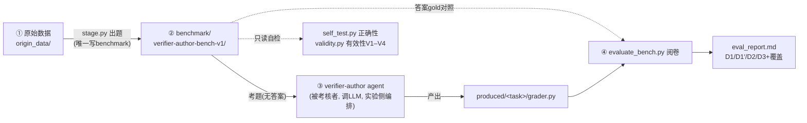
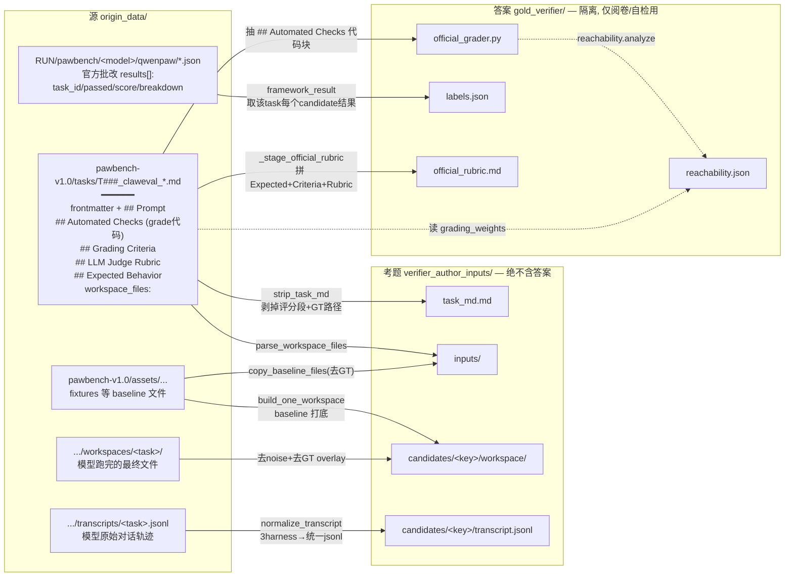
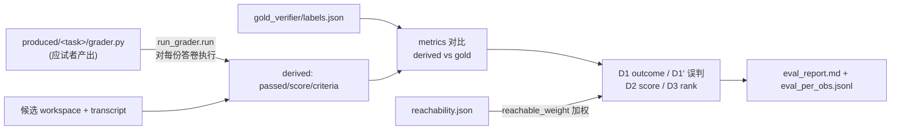

# verifier-author benchmark 架构与数据流

> 一句话：这是一个**考核「出题/批改能力」的 benchmark**——被考核的不是模型答题，而是
> agent 能否针对一个任务**写出一个好的批改程序（grader / verifier）**。

---

## 1. 它在考核什么

原始数据 `pawbench` 里已经有三样东西：**任务**、**8 个模型对该任务的答卷**、**官方对每份答卷的批改结果**。
这套系统把它改造成一场考试：

1. **藏起答案**（官方评分标准 + GT 参考解）→ 只把「任务 + 答卷」发给应试者；
2. 应试者（verifier-author agent）针对这个任务产出自己的 `grader.py`；
3. 拿这个 `grader.py` 去批改那 8 份答卷，和**官方批改结果（gold）**对比一致性 → 得出 D1–D3 分数。

直觉记法：`verifier_author_inputs/` = **试卷**，`gold_verifier/` = **答案册**。

---

## 2. 三阶段总览



**红线**：gold 层（答案）与 author 输入层（考题）物理隔离（宪法 C3/C17），`self_test` 自检考题层无 GT 残留；author 是否偷读 gold 另由 `leak_scan.scan_trajectory` 查其轨迹（§5.2）。

---

## 3. 出题数据流（核心：每个产出文件具体怎么来）

下图针对**一个 task**，展示每个产出文件来自哪个源、经哪个函数变换：



### 3.1 「考题」每个文件的由来

| 产出 | 源 | 变换（`benchmark/tools/`） |
|---|---|---|
| `task_md.md` | 源 task md | `lib.strip_task_md`：删 `## Automated Checks / Grading Criteria / LLM Judge Rubric / Expected Behavior` 段、删 frontmatter 的 `grading_type/grading_weights/grading`、删 `workspace_files` 里命中 GT 的条目；**保留** `## Prompt` 与环境字段 |
| `inputs/` | 源 assets | `lib.parse_workspace_files` 解析清单 → `lib.copy_baseline_files(keep_gt=False)` 拷 baseline 文件（跳过 GT） |
| `candidates/<key>/workspace/` | assets + 模型 workspace | `lib.build_one_workspace`：先 baseline 打底，再 overlay 模型跑完的文件，过滤运行时噪声（`.git`/sessions/`AGENTS.md`…）与 GT 路径 |
| `candidates/<key>/transcript.jsonl` | 源 `transcripts/<task>.jsonl` | `transcript_norm.normalize_transcript`：3 种 harness 原始格式 → 统一 unified-message，**不截断不摘要** |

> `<key>` = `qwenpaw__<model>`，共 8 个候选（候选矩阵定义在 `paths.CANDIDATE_SPECS`）。

### 3.2 「答案 gold」每个文件的由来

| 产出 | 源 | 变换 |
|---|---|---|
| `official_grader.py` | 源 task md 的 `## Automated Checks` | `strip_task_md` 把该段 ```python``` 代码块剥出 → 官方批改程序原文 |
| `labels.json` | 源跑分 `*.json` 的 `results[]` | `lib.framework_result(task_id, key)`：取每个 candidate 的 `passed/score/max_score/breakdown`，标 `source: framework_results` |
| `official_rubric.md` | 源 task md 的 3 个评分段 | `stage._stage_official_rubric`：拼接 `Expected Behavior + Grading Criteria + LLM Judge Rubric` |
| `reachability.json` | 官方 grader 源 + 源 task md | `reachability.analyze`：静态判断每个评分维度是否 generated grader 够得着，算 `reachable_weight` |

---

## 4. 产出目录结构

```text
benchmark/verifier-author-bench-v1/
├── manifest.json            # 清单: 版本/源/候选矩阵(8模型)/每个task状态
├── splits/                  # 视图层: 哪些task算 train / test (确定性切分)
│   ├── train.json
│   └── test.json
└── tasks/<task_id>/
    ├── verifier_author_inputs/      ← 【考题】发给应试者
    │   ├── task_md.md               #   任务描述(已剥评分标准)
    │   ├── inputs/                  #   任务初始文件(已去GT)
    │   └── candidates/<key>/        #   8 份答卷
    │       ├── workspace/           #     模型跑完的最终文件(去噪/去GT)
    │       └── transcript.jsonl     #     模型完整轨迹(归一化)
    └── gold_verifier/               ← 【答案】仅阅卷/自检
        ├── labels.json              #   官方批改: 每份答卷 passed/score/breakdown
        ├── official_grader.py       #   官方批改程序(参照)
        ├── official_rubric.md       #   官方评分标准(参照)
        └── reachability.json        #   可达性: 哪些维度generated grader够不着
```

---

## 5. 阅卷数据流（evaluate）



> 阅卷本身**不做反泄漏**——反泄漏是对 author **轨迹**的独立检查（见 §5.2），与一致性指标解耦。

指标全部是「应试者 grader 的批改结果 vs 官方 gold」的一致性。下面 §5.1 逐个讲清每个维度**算什么、分数怎么读**（用举例数值帮助理解），§5.2 讲反泄漏怎么判定。

### 5.1 各维度含义详解

所有指标都建立在一个基本单位上：**一次「观测」(obs) = 一个 (task, candidate) 对**。每个观测有两套判定：

- **derived**：应试者生成的 `grader.py` 的判定
- **gold**：数据自带官方 built-in verifier 的判定（视为真值）

每套判定都有两种形态：**二值 `passed`（PASS/FAIL）** 和 **连续 `score`（0–1）**。所有维度本质都在问「derived 和 gold 有多接近」。

**前置概念 · 可比 (comparable)**：只有 derived 和 gold **都非 None** 的观测才进统计。某 task 没产出 grader（或 grader 崩溃）时 derived=None → 该 task 全部观测**不可比**，被排除。

#### 覆盖率 coverage —— 「有多少观测能参与比较」

```
comparable_rate = 可比 obs / 总 obs
覆盖 task        = 有可跑 grader 的 task / 总 task
```

headline 指标只建立在可比子集上。举例：若 100 个 task、每个 8 份答卷 = 800 obs，只有 60 个 task 产出了能跑的 grader，则 comparable_rate ≈ 480/800 = 0.60，覆盖 60/100。**`comparable_rate < 0.5` 要预警**——headline 只反映一小撮 task，不能代表全局。

#### D1 outcome —— **headline 二值一致率（主指标）**

```
micro = (derived_passed == gold_passed 的可比观测数) / 可比观测数
macro = 先算每个 task 内的一致率，再对 task 等权平均
```

- **micro**：以「每个观测」为单位，candidate 多的 task 权重自然更大。
- **macro**：以「每个 task」为单位，每个 task 一票，消除 candidate 数量差异。

举例：480 个可比观测里有 300 个 derived 和 gold 判定相同 → micro = 300/480 = 0.625，即约 62% 的判定跟官方一致。**典型退出阈值是 micro ≥ 0.75**（如连续 2 轮 ≥0.75 或单轮 ≥0.80）。micro 与 macro 差距大时，说明「某些 candidate 多的大 task」拉偏了平均。

#### D1′ 误判方向 —— **错在哪个方向**

```
false_pass = derived 判 PASS 但 gold 判 FAIL   （放水）
false_fail = derived 判 FAIL 但 gold 判 PASS   （错杀）
```

这是把 D1 的不一致拆方向：

- **false_pass 高 = 偏宽松（overwide）**：把差的解放过去了
- **false_fail 高 = 偏严苛（overstrict）**：把对的解误杀了

由此派生两个红线比率：

```
overwide_rate   = false_pass / 可比 obs    红线 > 0.25
overstrict_rate = false_fail / 可比 obs    红线 > 0.15
```

举例：可比 480，false_pass=150、false_fail=20 → overwide_rate=0.31（超标）、overstrict_rate=0.04（正常），结论是 grader 整体太松。

#### D1 对照口径（gold_score ≥ 阈值）—— **区分「阈值效应」还是「真错」**

把 gold 的二值换一种算法：不用官方的 `passed`，而用 `gold_score ≥ 0.99` 重新二值化，再和 derived 比，得到一个对照 micro：

- 对照 micro **高于**主口径 → 分歧多是**阈值效应**（官方 PASS 门很严，接近满分仍判 FAIL，不全怪 grader）
- 对照 micro **≤** 主口径 → verifier **真不一致**（grader 自身的问题）

举例：主口径 micro=0.62，对照 micro=0.75 → 很多分歧其实是「官方阈值太严」造成的；若对照 micro=0.61 ≈ 主口径 → 是 grader 真判错。

#### D2 score —— **连续分数对齐**

不看 PASS/FAIL，看 0–1 分数本身：

```
MAE      = 平均 |derived_score − gold_score|        越小越好（0 = 完全贴合）
Spearman = derived 分与 gold 分的「秩相关」          ∈[−1,1]，越接近 1 越好；红线 < 0.6
```

Spearman 用**排名**而非原值算相关，对单调缩放稳健——它衡量「你打的高低趋势和官方一不一致」。举例：MAE=0.18 说明平均每个分数差 0.18；Spearman=0.4 说明你觉得高分的，官方只是弱相关地也觉得高分（趋势对得不好）。

#### D3 rank —— **task 内判别力（排序对不对）**

只在**同一个 task 内部**，把 candidates 两两配对：

```
对每对 (x,y)，先看 gold 谁分高，再看 derived 谁分高：
  concordant（一致）：两边都说 x>y
  discordant（反序）：gold 说 x>y，derived 却说 x<y
  derived 并列（ds==0）：算 neither，计入分母作惩罚
  gold 并列的对：不计（没有判别信号）

pairwise_acc = concordant / n_pairs
kendall_tau  = (concordant − discordant) / n_pairs    ∈[−1,1]
```

含义：**在一个 task 里，gold 认为更好的 candidate，你的 grader 是否也给了更高分。** 随机大约 0.5；**低于 0.5 说明排序比抛硬币还差**（常因 grader 把大量 candidate 打成同分 → ties 惩罚，或真反序）。红线 `pairwise_acc < 0.80`。D3 比 D1 更深：D1 只看二值门松紧，D3 看 grader 有没有抓住「谁比谁好」的结构特征——D3 很低意味着判别力本身缺失，光调 PASS 阈值救不了。

举例：某 task 8 份答卷两两共 28 对，其中 gold 非并列的 20 对里，14 对 derived 与 gold 同序、4 对反序、2 对 derived 并列 → pairwise_acc=14/20=0.70，kendall=(14−4)/20=0.50。

#### 可达性归一 reachable_weighted_macro

把每个 task 的一致率按「该 task 的评分维度有多少是 generated grader 理论上够得着的」权重做加权平均，并对照等权 `raw_macro`。用途：防止「天生够不着的难 task」拖低分数造成误读。举例：纯主观创作类 task 自动判分上限低，给它较低权重后，加权 macro 会比等权 raw 略高，更公平地反映「在可自动判分的范围内 grader 做得如何」。

### 5.2 反泄漏 —— 看 author 轨迹有没有读 gold

反泄漏**不是**阅卷指标，而是对 verifier-author agent **执行轨迹**的独立检查。

```
输入：author 的 cursor-agent --output-format stream-json 轨迹（含每次工具调用）
判定：scan_trajectory 只看 agent 实际发起的工具调用 args，是否触达 gold 目录 gold_verifier/
      触达 = 泄漏（读了答案）；未触达 = 干净。
```

两层防御（见宪法 C8）：

- **第一层 · 物理隔离（staging）**：gold 全部在 `gold_verifier/`，不进考题层 `verifier_author_inputs/`；`self_test` 用 `lib.is_gt_path` 自检考题层无 GT 残留。
- **第二层 · 轨迹取证（`leak_scan.scan_trajectory`）**：author 在仓库根运行、文件系统里 `gold_verifier/` 真实存在，理论上可被打开——所以扫它的轨迹，若任何 `readToolCall`/`shellToolCall` 的路径/命令含 `gold_verifier/`，即判泄漏。

**为什么这样最干净**：只看「agent 是否真的读了答案」这一**事实动作**，不对 grader 源码做子串猜测。读了就是读了、没读就是没读——零启发式、零误报。

> 历史教训：旧版「静态扫 grader.py 源码子串」（`answer_`/`reference_`/`expected_` 等）误报率极高——它分不清「候选自己的答卷（grader 本该读）」和「标准答案」，已废弃。

---

## 6. `benchmark/tools/` 文件职责

**地基层（被处处复用）**
- `paths.py` — 路径、候选矩阵（qwenpaw×8 模型）、GT 词表的**单一真相源**。
- `lib.py` — 读「原始数据」侧的共享 helper：解析/剥离 task md、物化 candidate workspace、GT 隔离判定。

**① 出题（唯一写 benchmark）**
- `stage.py` — 主入口（CLI）：原始数据 → 上面的目录树。
- `transcript_norm.py` — 3 种 harness 原始轨迹 → 统一 jsonl。
- `reachability.py` — 静态分析官方 grader 算可达性 → `reachability.json`。

**② 自检（只读 benchmark，两个 CLI）**
- `self_test.py` — 正确性：答案是否泄漏进考题？schema 是否齐全？gold 能否编译/解析？
- `validity.py` — 有效性 V1–V4：含答案重跑官方 grader 验 gold 自洽、区分度、读-GT 清单、可达权重。

**③ 阅卷（给 produced grader 打分）**
- `evaluate_bench.py` — 阅卷编排器（CLI），出 D1–D3 + 覆盖率。
- `bench_load.py` — 读「已出好的 benchmark」侧只读访问器。
- `run_grader.py` — **唯一**加载/执行应试者 `grader.py` 的地方（容错签名差异与崩溃）。
- `metrics.py` — D1–D3 一致性指标（纯函数）。
- `leak_scan.py` — 反作弊：`scan_trajectory` 扫 author 轨迹是否读取 `gold_verifier/`（§5.2）。

---

## 7. 常用命令

```bash
# 出题：原始数据 → benchmark（默认写 BENCH_OUT；可 --limit/--test-ratio/--seed）
python -m benchmark.tools.stage

# 自检
python -m benchmark.tools.self_test     # 正确性（隔离/schema/编译）
python -m benchmark.tools.validity      # 有效性 V1–V4

# 阅卷：对一轮 produced grader 打分
python -m benchmark.tools.evaluate_bench --produced-root <dir> --split train --report-dir <out>
```
