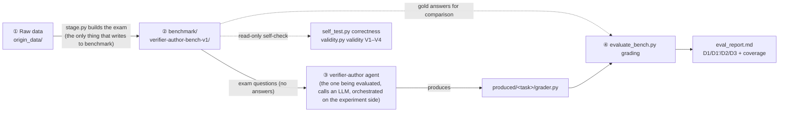
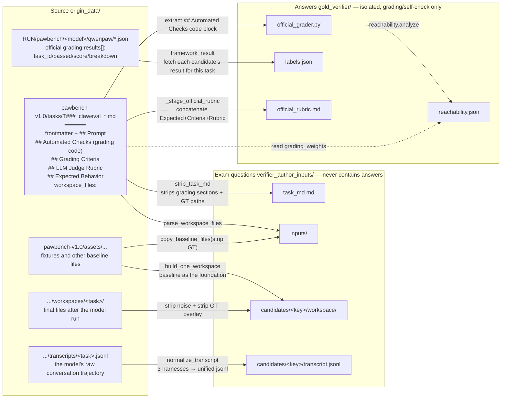
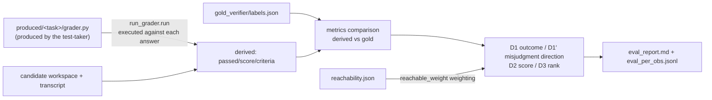

> Language: **English** · [中文](README.zh-CN.md)

# verifier-author benchmark: architecture and data flow

> One-liner: this is a benchmark that **evaluates the ability to "write questions / grade answers"** — what's being evaluated
> is not a model's answers, but whether an agent can **write a good grading program (grader / verifier)** for a given task.

---

## 1. What it evaluates

The raw data `pawbench` already contains three things: **tasks**, **8 models' answers to each task**, and **the official grading result for each answer**.
This system turns that into an exam:

1. **Hide the answers** (the official rubric + GT reference solution) → only send the "task + answers" to the test-taker;
2. The test-taker (the verifier-author agent) produces its own `grader.py` for that task;
3. Use that `grader.py` to grade the 8 answers, and compare its consistency against the **official grading result (gold)** → derive D1–D3 scores.

Intuitive mnemonic: `verifier_author_inputs/` = the **exam paper**, `gold_verifier/` = the **answer key**.

---

## 2. Three-stage overview


```mermaid
flowchart LR
    SRC["① Raw data<br/>origin_data/"] -->|"stage.py builds the exam<br/>(the only thing that writes to benchmark)"| BENCH["② benchmark/<br/>verifier-author-bench-v1/"]
    BENCH -->|"exam questions (no answers)"| AGENT["③ verifier-author agent<br/>(the one being evaluated, calls an LLM, orchestrated on the experiment side)"]
    AGENT -->|"produces"| PROD["produced/&lt;task&gt;/grader.py"]
    BENCH -.gold answers for comparison.-> EVAL["④ evaluate_bench.py grading"]
    PROD --> EVAL
    EVAL --> REP["eval_report.md<br/>D1/D1′/D2/D3 + coverage"]
    BENCH -.read-only self-check.-> CHECK["self_test.py correctness<br/>validity.py validity V1–V4"]
```

**Red line**: the gold layer (answers) is physically isolated from the author-input layer (exam questions) (Constitution C3/C17); `self_test` self-checks that no GT leaks into the exam-question layer. Whether the author secretly reads gold is separately checked via `leak_scan.scan_trajectory` inspecting its trajectory (§5.2).

---

## 3. Exam-generation data flow (core: exactly where each output file comes from)

The diagram below shows, for **one task**, which source each output file comes from and which function transforms it:


```mermaid
flowchart LR
    subgraph S["Source origin_data/"]
        T["pawbench-v1.0/tasks/T###_claweval_*.md<br/>━━━━━━<br/>frontmatter + ## Prompt<br/>## Automated Checks (grading code)<br/>## Grading Criteria<br/>## LLM Judge Rubric<br/>## Expected Behavior<br/>workspace_files:"]
        AS["pawbench-v1.0/assets/...<br/>fixtures and other baseline files"]
        FJ["RUN/pawbench/&lt;model&gt;/qwenpaw/*.json<br/>official grading results[]:<br/>task_id/passed/score/breakdown"]
        WS[".../workspaces/&lt;task&gt;/<br/>final files after the model run"]
        TR[".../transcripts/&lt;task&gt;.jsonl<br/>the model's raw conversation trajectory"]
    end

    T -->|"strip_task_md<br/>strips grading sections + GT paths"| MD["task_md.md"]
    T -->|"parse_workspace_files"| INP["inputs/"]
    AS -->|"copy_baseline_files(strip GT)"| INP
    AS -->|"build_one_workspace<br/>baseline as the foundation"| CWS["candidates/&lt;key&gt;/workspace/"]
    WS -->|"strip noise + strip GT, overlay"| CWS
    TR -->|"normalize_transcript<br/>3 harnesses → unified jsonl"| CTR["candidates/&lt;key&gt;/transcript.jsonl"]

    T -->|"extract ## Automated Checks code block"| OG["official_grader.py"]
    FJ -->|"framework_result<br/>fetch each candidate's result for this task"| LB["labels.json"]
    T -->|"_stage_official_rubric<br/>concatenate Expected+Criteria+Rubric"| RB["official_rubric.md"]
    OG -.->|"reachability.analyze"| RC["reachability.json"]
    T -.->|"read grading_weights"| RC

    subgraph IN["Exam questions verifier_author_inputs/ — never contains answers"]
        MD
        INP
        CWS
        CTR
    end
    subgraph GVO["Answers gold_verifier/ — isolated, grading/self-check only"]
        OG
        LB
        RB
        RC
    end
```

### 3.1 Where each "exam question" file comes from

| Output | Source | Transform (`benchmark/tools/`) |
|---|---|---|
| `task_md.md` | Source task md | `lib.strip_task_md`: removes the `## Automated Checks / Grading Criteria / LLM Judge Rubric / Expected Behavior` sections, removes `grading_type/grading_weights/grading` from the frontmatter, removes entries in `workspace_files` that match GT; **keeps** `## Prompt` and environment fields |
| `inputs/` | Source assets | `lib.parse_workspace_files` parses the manifest → `lib.copy_baseline_files(keep_gt=False)` copies baseline files (skipping GT) |
| `candidates/<key>/workspace/` | assets + model workspace | `lib.build_one_workspace`: lays down the baseline first, then overlays the files produced by the model run, filtering runtime noise (`.git`/sessions/`AGENTS.md`…) and GT paths |
| `candidates/<key>/transcript.jsonl` | Source `transcripts/<task>.jsonl` | `transcript_norm.normalize_transcript`: 3 raw harness formats → a unified unified-message format, **no truncation, no summarization** |

> `<key>` = `qwenpaw__<model>`, 8 candidates in total (the candidate matrix is defined in `paths.CANDIDATE_SPECS`).

### 3.2 Where each "gold answer" file comes from

| Output | Source | Transform |
|---|---|---|
| `official_grader.py` | The `## Automated Checks` section of the source task md | `strip_task_md` extracts the ```python``` code block from that section → the original text of the official grading program |
| `labels.json` | `results[]` from the source scoring `*.json` | `lib.framework_result(task_id, key)`: takes each candidate's `passed/score/max_score/breakdown`, tagged `source: framework_results` |
| `official_rubric.md` | The 3 grading sections of the source task md | `stage._stage_official_rubric`: concatenates `Expected Behavior + Grading Criteria + LLM Judge Rubric` |
| `reachability.json` | The official grader source + the source task md | `reachability.analyze`: statically determines whether the generated grader can reach each grading dimension, computes `reachable_weight` |

---

## 4. Output directory structure

```text
benchmark/verifier-author-bench-v1/
├── manifest.json            # Manifest: version/source/candidate matrix (8 models)/status of each task
├── splits/                  # View layer: which tasks count as train / test (deterministic split)
│   ├── train.json
│   └── test.json
└── tasks/<task_id>/
    ├── verifier_author_inputs/      ← [Exam questions] sent to the test-taker
    │   ├── task_md.md               #   Task description (grading standards already stripped)
    │   ├── inputs/                  #   Task's initial files (GT already removed)
    │   └── candidates/<key>/        #   8 answers
    │       ├── workspace/           #     Final files after the model run (denoised/GT removed)
    │       └── transcript.jsonl     #     The model's full trajectory (normalized)
    └── gold_verifier/               ← [Answers] grading/self-check only
        ├── labels.json              #   Official grading: passed/score/breakdown for each answer
        ├── official_grader.py       #   Official grading program (reference)
        ├── official_rubric.md       #   Official rubric (reference)
        └── reachability.json        #   Reachability: which dimensions the generated grader can't reach
```

---

## 5. Grading data flow (evaluate)


```mermaid
flowchart LR
    PG["produced/&lt;task&gt;/grader.py<br/>(produced by the test-taker)"] -->|"run_grader.run<br/>executed against each answer"| DR["derived: passed/score/criteria"]
    CWS2["candidate workspace + transcript"] --> DR
    GL["gold_verifier/labels.json"] --> CMP["metrics comparison<br/>derived vs gold"]
    DR --> CMP
    CMP --> D["D1 outcome / D1′ misjudgment direction<br/>D2 score / D3 rank"]
    RC2["reachability.json"] -->|"reachable_weight weighting"| D
    D --> OUT["eval_report.md + eval_per_obs.jsonl"]
```

> Grading itself **does not perform anti-leak checks** — anti-leak checking is an independent check on the author's **trajectory** (see §5.2), decoupled from the consistency metrics.

All metrics measure the consistency between "the test-taker grader's grading result vs. the official gold". §5.1 below walks through each dimension one at a time — **what it computes and how to read the score** (using example numbers to help understanding) — and §5.2 covers how anti-leak detection is determined.

### 5.1 Detailed explanation of each dimension

All metrics are built on one basic unit: **one "observation" (obs) = one (task, candidate) pair**. Each observation has two judgments:

- **derived**: the judgment made by the test-taker's generated `grader.py`
- **gold**: the judgment from the data's own official built-in verifier (treated as ground truth)

Each judgment comes in two forms: a **binary `passed`** (PASS/FAIL) and a **continuous `score`** (0–1). Every dimension is fundamentally asking "how close are derived and gold to each other".

**Prerequisite concept · comparable**: only observations where both derived and gold are **non-None** are included in the statistics. If a task fails to produce a grader (or the grader crashes), derived=None → **all** observations of that task are **not comparable** and are excluded.

#### Coverage — "how many observations can be compared"

```
comparable_rate = comparable obs / total obs
task coverage    = tasks with a runnable grader / total tasks
```

The headline metrics are computed only over the comparable subset. Example: with 100 tasks × 8 answers each = 800 obs, if only 60 tasks produced a runnable grader, then comparable_rate ≈ 480/800 = 0.60, with 60/100 coverage. **`comparable_rate < 0.5` should trigger a warning** — the headline numbers then only reflect a small slice of tasks and can't represent the whole.

#### D1 outcome — **headline binary agreement rate (primary metric)**

```
micro = (number of comparable observations where derived_passed == gold_passed) / comparable observations
macro = compute the agreement rate within each task first, then average across tasks with equal weight
```

- **micro**: computed per observation, so tasks with more candidates naturally carry more weight.
- **macro**: computed per task, one vote per task, removing the effect of differing candidate counts.

Example: of 480 comparable observations, 300 have matching derived and gold judgments → micro = 300/480 = 0.625, i.e. about 62% of judgments agree with the official result. **The typical exit threshold is micro ≥ 0.75** (e.g. ≥0.75 for 2 consecutive rounds, or ≥0.80 in a single round). A large gap between micro and macro indicates that "certain large tasks with many candidates" are skewing the average.

#### D1′ misjudgment direction — **which direction the errors go**

```
false_pass = derived says PASS but gold says FAIL   (letting bad answers through)
false_fail = derived says FAIL but gold says PASS   (wrongly failing good answers)
```

This splits D1's disagreement by direction:

- **High false_pass = leaning lenient (overwide)**: it lets weak solutions through
- **High false_fail = leaning strict (overstrict)**: it wrongly fails correct solutions

Two red-line ratios are derived from this:

```
overwide_rate   = false_pass / comparable obs    red line > 0.25
overstrict_rate = false_fail / comparable obs    red line > 0.15
```

Example: with 480 comparable, false_pass=150, false_fail=20 → overwide_rate=0.31 (over the red line), overstrict_rate=0.04 (normal). The conclusion is that the grader is overall too lenient.

#### D1 alternate framing (gold_score ≥ threshold) — **distinguishing a "threshold effect" from a "true error"**

Re-binarize gold using a different rule: instead of the official `passed`, use `gold_score ≥ 0.99`, then compare against derived to get an alternate micro:

- Alternate micro **higher than** the primary framing → most disagreement is a **threshold effect** (the official PASS bar is very strict, near-perfect scores can still be FAIL — not entirely the grader's fault)
- Alternate micro **≤** the primary framing → the verifier is **genuinely inconsistent** (a problem with the grader itself)

Example: primary micro=0.62, alternate micro=0.75 → much of the disagreement is actually caused by "the official threshold being too strict"; if instead alternate micro=0.61 ≈ primary micro → the grader is genuinely misjudging.

#### D2 score — **continuous score alignment**

Instead of PASS/FAIL, look at the 0–1 score itself:

```
MAE      = average |derived_score − gold_score|        lower is better (0 = perfect match)
Spearman = "rank correlation" between derived scores and gold scores    ∈[−1,1], closer to 1 is better; red line < 0.6
```

Spearman computes correlation on **ranks** rather than raw values, making it robust to monotonic scaling — it measures whether "the high/low trend of your scores agrees with the official one". Example: MAE=0.18 means each score differs by 0.18 on average; Spearman=0.4 means that what you rate as high-scoring is only weakly correlated with what the official result also rates as high-scoring (the trend doesn't match well).

#### D3 rank — **within-task discriminative power (is the ranking correct)**

Within a **single task only**, pair up candidates:

```
For each pair (x,y), first check who gold scores higher, then who derived scores higher:
  concordant: both sides agree x>y
  discordant: gold says x>y, but derived says x<y
  derived tie (ds==0): counted as neither, included in the denominator as a penalty
  pairs where gold ties: excluded (no discriminative signal)

pairwise_acc = concordant / n_pairs
kendall_tau  = (concordant − discordant) / n_pairs    ∈[−1,1]
```

Meaning: **within a task, does your grader also give a higher score to the candidate that gold considers better.** Random chance is about 0.5; **below 0.5 means the ranking is worse than a coin flip** (often because the grader assigns the same score to many candidates → tie penalty, or because it's genuinely inverted). Red line: `pairwise_acc < 0.80`. D3 goes deeper than D1: D1 only looks at how loose/strict the binary gate is, while D3 checks whether the grader has captured the structural signal of "who is better than whom" — a very low D3 means the discriminative power itself is missing, and no amount of adjusting the PASS threshold can fix that.

Example: a task has 8 answers, 28 pairs in total; among the 20 pairs where gold is not tied, 14 pairs have derived agreeing with gold's order, 4 pairs are inverted, and 2 pairs have derived tied → pairwise_acc=14/20=0.70, kendall=(14−4)/20=0.50.

#### Reachability-normalized reachable_weighted_macro

Weight each task's agreement rate by "how many of that task's grading dimensions are, in principle, reachable by the generated grader", producing a weighted average, and compare it against the equal-weight `raw_macro`. Purpose: to prevent "hard tasks that are inherently unreachable" from dragging down the score and causing misinterpretation. Example: purely subjective, creative-writing-style tasks have a low ceiling for automatic grading; giving them a lower weight makes the weighted macro slightly higher than the equal-weight raw score, more fairly reflecting "how well the grader performs within the range that can be automatically graded".

### 5.2 Anti-leak — checking whether the author's trajectory read gold

Anti-leak detection is **not** a grading metric — it's an independent check on the verifier-author agent's **execution trajectory**.

```
Input: the author's cursor-agent --output-format stream-json trajectory (containing every tool call)
Judgment: scan_trajectory only looks at the args of tool calls actually issued by the agent, checking whether they touch the gold directory gold_verifier/
          Touched = leak (read the answers); not touched = clean.
```

Two layers of defense (see Constitution C8):

- **Layer 1 · Physical isolation (staging)**: gold lives entirely in `gold_verifier/` and never enters the exam-question layer `verifier_author_inputs/`; `self_test` uses `lib.is_gt_path` to self-check that no GT remains in the exam-question layer.
- **Layer 2 · Trajectory forensics (`leak_scan.scan_trajectory`)**: the author runs at the repo root, and `gold_verifier/` genuinely exists on the filesystem — so in principle it could be opened. Hence its trajectory is scanned: if any `readToolCall`/`shellToolCall` path or command contains `gold_verifier/`, it's judged a leak.

**Why this is the cleanest approach**: it only looks at the **factual action** of "did the agent actually read the answers", without guessing based on substrings in the grader's source code. Read is read, not-read is not-read — zero heuristics, zero false positives.

> Lesson from history: the old approach of "statically scanning `grader.py` source for substrings" (`answer_`/`reference_`/`expected_`, etc.) had an extremely high false-positive rate — it couldn't distinguish "a candidate's own answer (which the grader is supposed to read)" from "the standard answer", and has been deprecated.

---

## 6. Responsibilities of files in `benchmark/tools/`

**Foundation layer (reused everywhere)**
- `paths.py` — the **single source of truth** for paths, the candidate matrix (qwenpaw × 8 models), and the GT vocabulary.
- `lib.py` — shared helpers for reading the "raw data" side: parsing/stripping task md, materializing candidate workspaces, GT isolation checks.

**① Exam generation (the only thing that writes to benchmark)**
- `stage.py` — main entry point (CLI): raw data → the directory tree above.
- `transcript_norm.py` — 3 raw harness trajectory formats → unified jsonl.
- `reachability.py` — statically analyzes the official grader to compute reachability → `reachability.json`.

**② Self-check (read-only against benchmark, two CLIs)**
- `self_test.py` — correctness: has any answer leaked into the exam questions? Is the schema complete? Can gold be compiled/parsed?
- `validity.py` — validity V1–V4: reruns the official grader with the answers included to verify gold's self-consistency, discriminative power, the read-GT list, and reachable weights.

**③ Grading (scoring the produced grader)**
- `evaluate_bench.py` — the grading orchestrator (CLI), producing D1–D3 + coverage.
- `bench_load.py` — read-only accessors for the "already-generated benchmark" side.
- `run_grader.py` — the **only** place that loads/executes the test-taker's `grader.py` (tolerant of signature differences and crashes).
- `metrics.py` — D1–D3 consistency metrics (pure functions).
- `leak_scan.py` — anti-cheating: `scan_trajectory` scans the author's trajectory for reads of `gold_verifier/` (§5.2).

---

## 7. Common commands

```bash
# Generate the exam: raw data → benchmark (writes to BENCH_OUT by default; supports --limit/--test-ratio/--seed)
python -m benchmark.tools.stage

# Self-check
python -m benchmark.tools.self_test     # correctness (isolation/schema/compilation)
python -m benchmark.tools.validity      # validity V1–V4

# Grading: score one round of produced graders
python -m benchmark.tools.evaluate_bench --produced-root <dir> --split train --report-dir <out>
```
